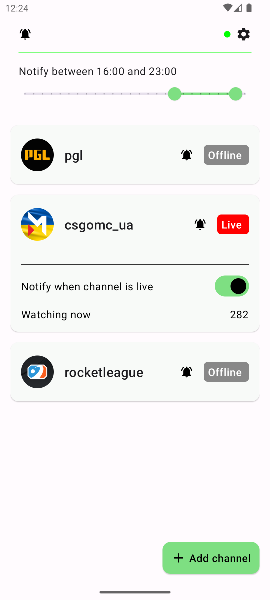
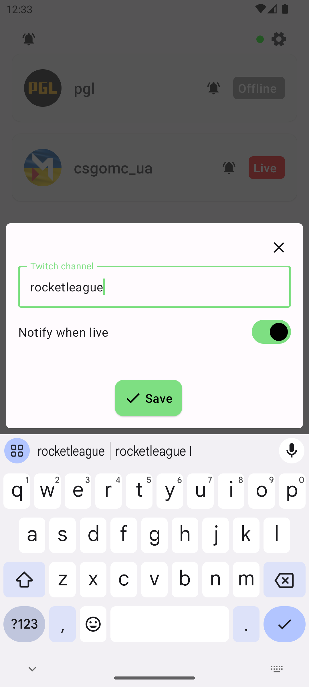
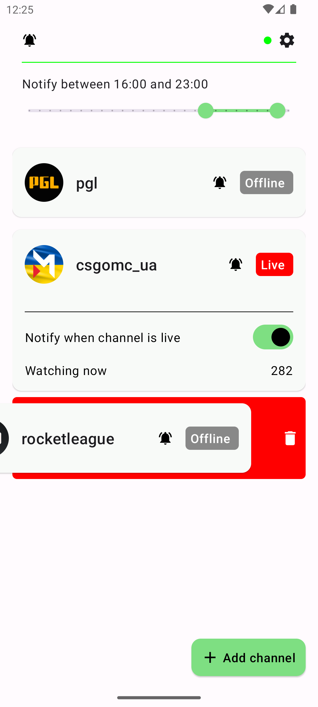
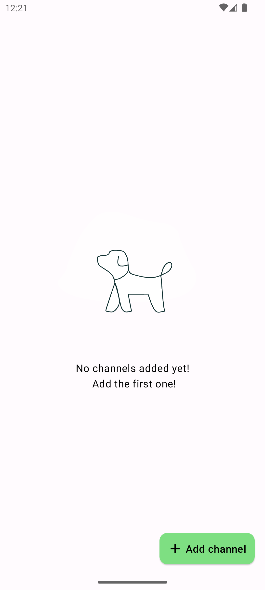

# TwitchWatchdog

An alert app notifying about Twitch channels going live without the need to register on the service.

# Disclaimer

This is pet project intended to showcase skills and serve as playground for dev experiments and any
commercial use is not allowed. This is not a competitor/alternative for official Twitch app or
services.

## Screenshots

## Table of Contents

- [Overview](#overview)
- [Features](#features)
- [Contributing](#contributing)
- [License](#license)
- [Acknowledgements](#acknowledgements)

## Overview

Following Twitch channels without registration is still possible just need a bit of magic.
This is partially playground and pet project for tuning dev skills and covering previously not used
API.
I have tried to follow best system design practices (Clean Architecture, Clean code and SOLID) to
make
project scalable and easy to maintain.

## Features

- Create an alert when channel goes live
- Specify time range when notifications should be posted.
- Open stream when channel is live

## Architecture

- Clean architecture
- SOLID
- MVVM

## Tech stack

- Kotlin
- Coroutines
- Compose
- Hilt
- DataStore
- JobScheduler

## License

This project is licensed under the GPL-3.0 license - see the [LICENSE](LICENSE) file for details.

## Acknowledgements

- [Jsoup](https://jsoup.org/)
- [Lottie](https://airbnb.design/lottie/)
- [LottieFiles](https://lottiefiles.com/)